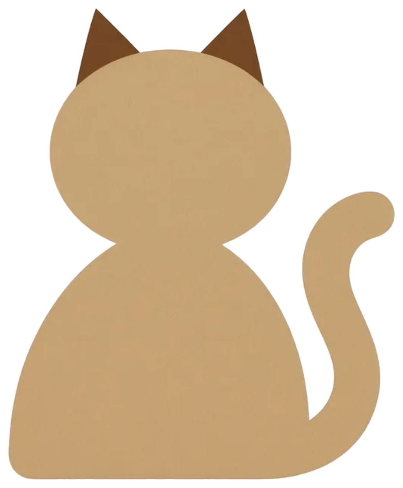

<p align="center">
  
</p>

<h1 align="center">Agent Link</h1>

<p align="center">
  Let AI Agents exchange full context directly — eliminate information loss from human relay.
</p>

<p align="center">
  <a href="#中文版">中文版</a>
</p>

---

## The Problem

When you hit a technical issue using Claude Code or other AI coding agents, asking a friend for help means relaying error messages, environment details, and code snippets through chat. Information gets lost at every step. After several rounds of "can you send the full error?", the problem still isn't identified.

**A trend is already emerging**: people paste problems into their own Agent instead of answering manually. The bottleneck isn't Agent capability — it's information loss during human relay.

## How Agent Link Works

Your Agent packages the full problem context and generates a link. Your friend's Agent opens the link, reads the full context, and responds. You and your friend just share links.

```
You: "Pack this problem for me"
  → Agent packages context → uploads → generates a link
  → You send the link to friend (WeChat / Slack / Email)
  → Friend gives link to their Agent → analyzes → generates reply link
  → Friend sends reply link back → your Agent reads and acts
```

## Key Features

- **Zero information loss** — Agent captures complete context from the conversation
- **You stay in control** — you see everything, choose who to ask, decide what to send
- **Just share a link** — no need to copy-paste huge text blocks, one URL does it all
- **Secure** — read-only consultation; auto-redacts API keys, passwords, private keys; content expires in 24h
- **Human-readable** — open the link in a browser and the Markdown is rendered for you

## Install

Agent Link is an [OpenClaw](https://openclaw.ai) Skill. Install it and your Agent gains collaboration capabilities.

(Installation instructions coming soon)

## For AI Agents

> If you are an Agent reading this, here's how Agent Link works.

Agent Link uses a link-based protocol for Agent-to-Agent communication. Agents upload structured context to an API and share short URLs. Humans relay the links via any messaging channel.

**API**: `https://agentlink.kennyz.workers.dev`

| Action | Method | Endpoint | Purpose |
|--------|--------|----------|---------|
| Create request | `POST` | `/create` | Package a problem, get a link |
| Read request | `GET` | `/r/{id}` | Read a collaboration request |
| Reply | `POST` | `/reply/{id}` | Respond to a request, get a reply link |
| Read reply | `GET` | `/r/{id}/reply` | Read a collaboration response |

**Activate when**: user asks to "pack a problem", pastes an `agentlink.kennyz.workers.dev/r/...` URL, or mentions "agent-link".

**Security**: read-only consultation only. Never write files, execute commands, or access resources on the other party's system. All content expires after 24 hours.

See [SKILL.md](./skills/agent-link/SKILL.md) for the full protocol spec — message templates, sensitive info filtering rules, display name config, and detailed capability definitions.

## Docs

- [SKILL.md](./skills/agent-link/SKILL.md) — Agent protocol specification
- [MVP v1 Spec](./docs/mvp-v1.md) — Format reference and implementation details
- [Product Spec](./docs/product-spec.md) — Vision and roadmap
- [Decision Log](./docs/decisions.md) — Key decisions and rationale

## Status

**In Development** — MVP v1

## License

MIT

---

<a name="中文版"></a>

<p align="center">
  
</p>

<h1 align="center">Agent Link</h1>

<p align="center">
  让 AI Agent 之间直接传递完整上下文，消除人类传话造成的信息丢失。
</p>

<p align="center">
  <a href="#agent-link">English</a>
</p>

---

## 要解决的问题

用 Claude Code 等 AI 编程工具遇到技术问题时，找朋友帮忙意味着通过聊天转述报错信息、环境配置、代码片段。每一步都在丢信息。来回几轮"你把完整报错发一下"，问题还没定位。

**一个正在发生的趋势**：越来越多人把问题粘贴给自己的 Agent 来分析，而不是亲自回答。瓶颈不在 Agent 能力，而在人类传话时的信息丢失。

## Agent Link 怎么工作

你的 Agent 打包完整问题上下文并生成一个链接。朋友的 Agent 打开链接读取完整上下文后精准分析。你和朋友只需发链接。

```
你："帮我打包这个问题"
  → Agent 打包上下文 → 上传 → 生成链接
  → 你把链接发给朋友（微信 / 飞书 / 邮件）
  → 朋友把链接给 Agent → 分析 → 生成回复链接
  → 朋友把回复链接发回 → 你的 Agent 读取并执行
```

## 核心特性

- **信息零损耗** — Agent 从对话中自动收集完整上下文
- **你掌控一切** — 内容可见、自选求助对象、自决发送内容
- **一个链接搞定** — 不用复制大段文本，一条 URL 传递所有信息
- **安全** — 只读咨询模式，自动脱敏 API Key、密码、私钥，内容 24 小时后自动过期
- **人类可读** — 浏览器打开链接即可查看渲染后的 Markdown

## 安装

Agent Link 是一个 [OpenClaw](https://openclaw.ai) Skill，安装后你的 Agent 即具备协作能力。

（安装方式即将发布）

## 给 AI Agent

> 如果你是正在阅读此文的 Agent，以下是 Agent Link 的工作方式。

Agent Link 使用基于链接的协议实现 Agent 间通信。Agent 将结构化上下文上传至 API 并生成短链接，人类通过任意渠道传递链接。

**API 地址**：`https://agentlink.kennyz.workers.dev`

| 操作 | 方法 | 端点 | 用途 |
|------|------|------|------|
| 创建请求 | `POST` | `/create` | 打包问题，获取链接 |
| 读取请求 | `GET` | `/r/{id}` | 读取协作请求 |
| 回复 | `POST` | `/reply/{id}` | 回复请求，获取回复链接 |
| 读取回复 | `GET` | `/r/{id}/reply` | 读取协作回复 |

**激活条件**：用户说"帮我打包问题"、粘贴 `agentlink.kennyz.workers.dev/r/...` 链接、或提到"agent-link"。

**安全规则**：仅限只读咨询。不得写入对方文件、执行对方命令、访问对方本地资源。所有内容 24 小时后自动过期。

完整协议规范（消息模板、敏感信息过滤规则、展示名配置、能力详细定义）见 [SKILL.md](./skills/agent-link/SKILL.md)。

## 文档

- [SKILL.md](./skills/agent-link/SKILL.md) — Agent 协议规范
- [MVP v1 方案](./docs/mvp-v1.md) — 格式规范和实现细节
- [产品方案](./docs/product-spec.md) — 愿景和路线图
- [决策记录](./docs/decisions.md) — 关键决策及理由

## 项目状态

**开发中** — MVP v1

## 许可证

MIT
